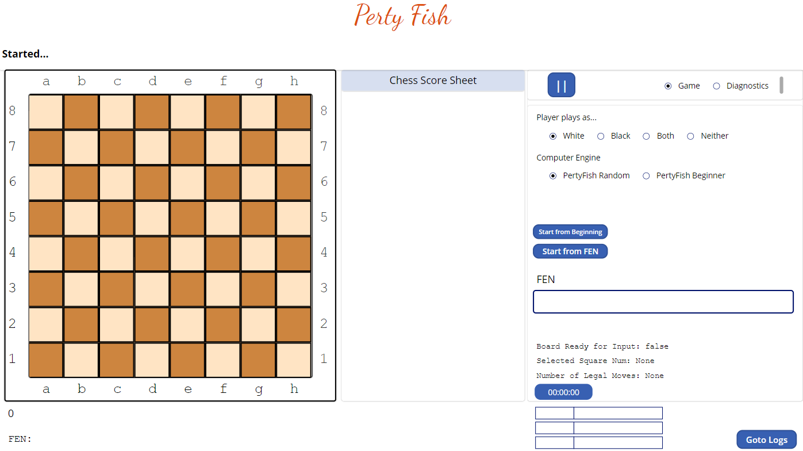

# PertyFish - A Chess Game w/ built-in chess engine Power Apps Canvas App written entirely in PowerFx

This project is a Chess Game written entirely in PowerFx (the low code language used in Power Apps development). This project was created by the author as a fun way to learn how to create a Power Apps Canvas Application. The game supports human vs. human play, human vs. computer (the built in chess engine logic), and computer vs. computer (i.e., it can play against itself). The goal of the project is NOT to create a powerful chess game/engine , but rather to create one that works, is fully functional, and written entirely using low code. PertyFish only allows legal chess moves, including the tricky stuff like castling, en passant captures, and pawn promotions. It is understood that low code is the wrong tool for the job (the job being writing a chess engine) but that is the hill we are trying to climb in this project.

## Project Status

This is the author's first open source project and therefore the first attempt at managing an OSS project. At this time the author is the only contributor and is in the process of learning lots of new things Github related. Additional contributors are welcome however be warned that the author is new at all of this OSS, Github, and Power App technologies, so please be patient. The author works on this project as a hobby, and generally adds code and checks project status at least monthly (usually weekly).

The current stable release of this project is release v0.0.1 -> It is the first public release of this program and includes the following functionality:
- Suupports  human vs. human play, human vs. computer, and computer vs. computer
- Only allows legal moves including castling, en passant captures, and pawn promotions.
- What is missing - the *docs/ProjectManagement* document contains a break down of needed work to move this project forward
  - a key area is improvement in the chess engine logic - v0.0.1 only supports random moves

## Low Code Limitations

This project acknowledges that using low code for a chess chess engine is a case of using the wrong tool for the job. And it is understood that this is more of an academic exercise to gain experience in PowerFx development using a project that some may find more interesting than the standard useful business related examples. Performance is a limitation, the author has also ran into size limitations in private versions of this project. For example as the number of controls, and items in key areas such as App.OnStart and App.Formulas grows to a certain point the amount of time changes take to save and the speed at which the program can run definately hits some boundaries. So some of the upcoming work in this project will be to attempt increase the level of the the programs computer chess engine logic while keeping response times and program size managable.

Analyzing moves in depth is a staple in chess engine development, unfortunately the amount of resources and programming language capability seems to be out of reach with a low code language, or accomplishing a search depth greater than 1 and maintaining a reasonable response time seems to be out of reach anyway. Or maybe it's just out of reach for the skills of the original author, analysis in depth is a limitation that must be overcome in order to develop chess engine logic that can play above a certain level (~1000 ELO is a guess). Furture enhancements to this project will be to see how far up the ladder it can climb and remain in the low code language domain. Until then the limitation in the search depth for a move is 1. Yes, chess engine developers using "High Code" languages (is that the proper term ?) would politely smile and walk away when given such a limitation, but none the less that is the challenge we face as we try to use the wrong tool for the job to see how far we can progress and learn.

## Installation 

Development is done through [Power Apps Sudio](https://make.powerapps.com/). Create a new blank application (tablet format), in the application's settings the features that need to be enabled for this project are:
- Enhanced Component Properties
- Show Git version control setting
- User-defined functions
Other features can be enabled, whatever is enabled by default is fine.
- Fork the PertyFish project
- Under the git setting within your new blank application click on the "Git version control" and click the "Connect" button to create a connection to your fored repository. Fill out and complete connection details when prompted.

Another untested (by this project) method is to use the following steps:
- Clone the repository to a local drive 
- Pack the source files back into `.msapp` file:
  - [Power Apps Tooling Usage](https://github.com/microsoft/PowerApps-Language-Tooling)
- Within **Power Apps Studio**, use the `.msapp` file using **File** > **Open** > **Browse** and select the `.msapp` file you just packed.

## Usage

- Set the Player settings however you want.
- Set the Chess Engine settings however you want.
- Click start from beginning button and a new game begins.

- For a human to make a move left click on the source square of the move you want to make, and then click on the target square.
  - Only legal moves will be allowed.
  - The computer will moves its pieces on its own when it is it's turn
- Monitor the Score Sheet in the center of the screen for a list of the moves made in the game so far.
- The program will monitor for checkmate, and will also watch for 3 move repetition stalemates.
- To start a new game press the start from beginning.

Optionally you can start a game using a FEN string - paste a complete FEN string text input control and press the "Start from FEN" button".

## Testing

Private versions of this program had lots of built in diagnostics and unit tests. There were also lots of perft tests that could be run at the press of a button to validate chess engine functionalitity. For those unfamiliar a perft test in chess can (among many things) be used to validate a chess engines' ability to generate the correct number of legal moves at a given depth. Until the time that the original performance limitations of this project improve, the original max search depth of 1 applies. In this public version most of the test/diagnostics code has been removed in order to reduce the footprint of the program and thereby speed up save/load times.

Even though most of the automatted tests and diagnostics were taken out, there is still a very useful and easy way to test validity of the chess engine. Do a manual perft test, do then setting the Player settings to not use the computer engine (i.e., human only play), paste in the FEN text input control a valid FEN string, and then press the Start from FEN.
- You will see the number of legal moves that the chess engine has calculated to be display in the "Number of legal Moves: " text label.
  - The reason we select Human only play was so that the program would not hurry off and work on a computer move, thereby changing the value of this field before we had a chance to analyze it.
- The correct number of legal moves can be determined in any number of ways. A simple method for folks with experience using the stockfish chess engine is to enter the FEN into stockfish and make sure the PertyFish results match the "go perft 1" results that stockfish found. See [testing guide](docs/Testing.md).

## Contributing

Contributions may be made to this project. The project owner is new to the OSS world so asks for patience in this endeavor. The anticpated contribution process will be standard steps that look something like:

1. Fork the Repository:
  - Create a copy of the PertyFish repository on your GitHub account.
3. Create a New Branch:
  - Create a new branch from the master branch.
4. Create a new blank application in Power Apps Studio and follow the [Installation](#Installation) instructions. 

5. Make Your Changes:
  - Make your desired changes to the code, documentation, or other project components. And test to make sure nothing is broke and the new feature/capability works.
  - Save changes to your repository as needed.
6. Push Your Branch to Your Fork:
  - Upload your branch to your forked repository on GitHub.
7. Create a Pull Request:
  - Submit a pull request from your branch to the master branch of the PertyFish project.
8. Address Feedback:
  - Provide feedback or work on requested changes, address them in your branch and push the updates to your fork.
9. Merge Your Pull Request:
  - Once your changes are approved, the maintainers will merge your pull request, incorporating your contributions into the main project.

## License

This project is licensed under the GPLv3 license. See [LICENSE](LICENSE)

## Acknowledgements

PowerFX and Canvas App Knowledge
- All of the great Microsoft learning articles starting with [Canvas Apps Formula Reference](https://learn.microsoft.com/en-us/power-platform/power-fx/formula-reference-canvas-apps)
- Mr. Devaney is a legend [Mattew Devaney Power Apps](https://www.matthewdevaney.com/)

Chess Engine Knowledge
- The best place to start -> [Chess Programming Wiki](https://www.chessprogramming.org/Main_Page)
- The Code Monkey King (Maksim (Maksym) Korzh) - the guy who inspired the madness for this project and several others. Starting with this You tube series [Bitboard CHESS ENGINE in C: intro](https://www.youtube.com/watch?v=QUNP-UjujBM)
- Great artical [Peter Ellis Jones](https://peterellisjones.com/posts/generating-legal-chess-moves-efficiently/)
- lots of chess EPD files - which contain FENs that can be used for perft tests [Chris Whittington EPD Collection](https://github.com/ChrisWhittington/Chess-EPDs) 

